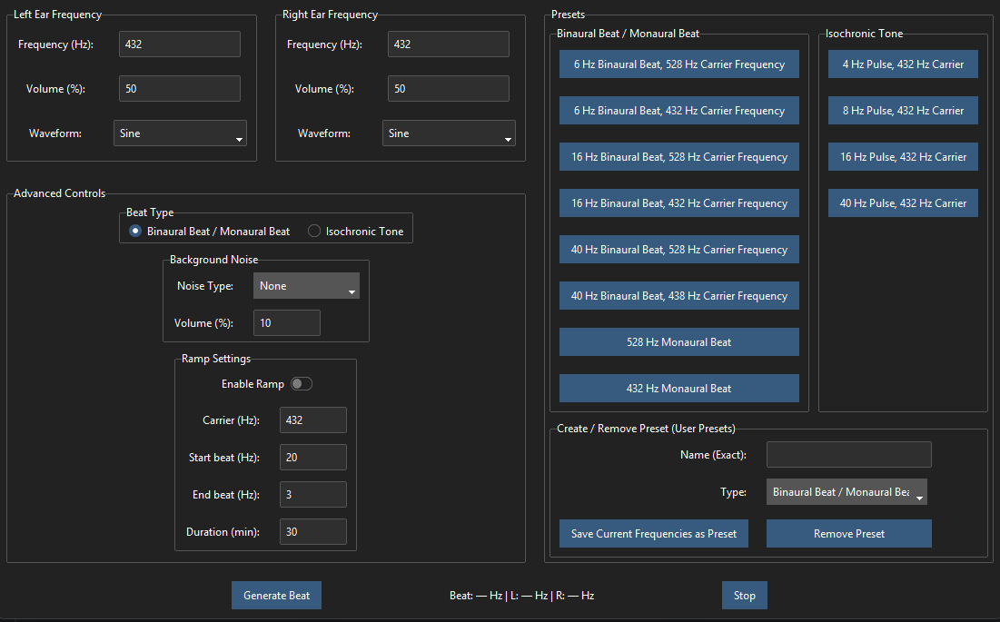

<div align="center">

# NeuralBeat 1.0.0

**The Ultimate Neuro-Acoustic Desktop Application**

*A scientifically verified, local-first binaural beat, monaural beat, and isochronic tone generator.*

</div>


<div align="left">
  
</div>

---

## 🌟 Why NeuralBeat?

**NeuralBeat** is a precision-engineered desktop application for generating audio tones. Whether you're interested in meditation, focus enhancement, or audio experimentation, NeuralBeat provides the tools you need.

### What Makes NeuralBeat Different?

- 🎯 **Scientific Precision**: Every tone is mathematically generated with clinical-grade accuracy
- 🔒 **100% Private**: No internet, no accounts, no tracking - everything runs locally on your machine
- 🎨 **Fully Customizable**: Multiple waveforms, themes, and advanced controls
- 🧪 **Scientifically Verified**: Built-in verification system ensures exact frequency output
- 🚀 **Modern Experience**: Beautiful UI with real-time visualization

---

## 🧠 The Science of Brainwave Entrainment

> **Disclaimer**: The following information is for educational purposes only. Brainwave entrainment effects vary from person to person and is not intended to diagnose, treat, cure, or prevent any disease. Please consult your healthcare provider before using audio entrainment tools, especially if you have medical conditions.

Your brain produces electrical waves at different frequencies depending on your mental state. By exposing your brain to specific sound frequencies, you can encourage it to match or "entrain" to desired brainwave patterns. This is the principle behind neuro-acoustic stimulation.

### The Four Main Brainwave States

| State | Frequency | Characteristics | Common Uses |
|-------|-----------|----------------|-------------|
| **Delta** | 0.5 - 4 Hz | Deep, dreamless sleep | Rest, relaxation |
| **Theta** | 4 - 8 Hz | Light sleep, deep relaxation | Meditation, creativity |
| **Alpha** | 8 - 12 Hz | Calm, relaxed focus | Stress relief, calm |
| **Beta** | 12 - 30 Hz | Active thinking, alertness | Focus, concentration |
| **Gamma** | 30 - 80 Hz | Peak cognition | Learning, memory |

---

## 🔊 Understanding Beat Types

### Binaural Beats
Binaural beats are perhaps the most well-known form of brainwave entrainment. When two slightly different frequencies are played simultaneously - one in each ear - your brain perceives a third tone, known as the "binaural beat," at the mathematical difference between the two frequencies.

**Example**: 
- Left Ear: 432 Hz
- Right Ear: 440 Hz
- Perceived Beat: 8 Hz (Alpha state)

**How It Works**: Your brain processes the phase difference between the two tones and naturally synchronizes to the beat frequency. This phenomenon is called **frequency following response (FFR)**.

**Requirements**: Stereo headphones are essential for binaural beats to work properly, as the two ears must receive different frequencies.

**Advantages**:
- Very precise frequency targeting
- Well-researched and documented effects
- Subtle and comfortable listening experience

---

### Monaural Beats
Monaural beats are created by physically mixing two different frequencies into a single mono signal before the sound reaches your ears. The beating effect happens in the air itself, not within the brain.

**How It Works**: When two sine waves of different frequencies are combined, they create an interference pattern that pulses at the difference frequency. This pulsing is literally present in the sound wave itself.

**Requirements**: Can be used with speakers or headphones, making them more versatile than binaural beats.

**Advantages**:
- Works with speakers (no headphones required)
- Some users find them more effective than binaural beats
- Better for group sessions or meditation classes

---

### Isochronic Tones
Isochronic tones represent the most recent advancement in brainwave entrainment technology. They consist of a single tone that rhythmically turns on and off at regular intervals, creating sharp, distinct pulses.

**How It Works**: A carrier tone (the pitch you hear) is amplitude-modulated to turn on and off at the desired brainwave frequency. For example, a 528 Hz tone that pulses 10 times per second creates a 10 Hz isochronic tone.

**Requirements**: Works with both headphones and speakers, offering maximum flexibility.

**Advantages**:
- Most intense form of entrainment
- Works with or without headphones
- Fastest acting - often produces results in minutes
- No stereo separation required

---

## ✨ Key Features

### 🎵 Three Beat Modes
- **Binaural Beats**: Classic stereo brainwave entrainment
- **Monaural Beats**: Mono signal for speaker use
- **Isochronic Tones**: Rhythmic pulses for maximum effectiveness

### 🔊 Precise Audio Engine
- Generate mathematically accurate tones with **clinical-grade precision**
- Support for multiple waveforms:
  - **Sine**: Pure, smooth tones - ideal for beginners
  - **Square**: Rich harmonics - for deeper entrainment
  - **Sawtooth**: Bright, buzzy - for intense stimulation
  - **Triangle**: Soft, mellow - for gentle relaxation
- Phase-continuous frequency transitions (no clicks or pops)

### 📈 Advanced Ramp Control
- Gradually transition from one brainwave state to another
- Set custom start and end beat frequencies
- Configure duration from 1 minute to 60+ minutes
- Perfect for guided meditation sessions
- Smooth, linear frequency interpolation

### 🌊 Background Noise Generator
- Mix in ambient noise to mask external distractions:
  - **White Noise**: Full spectrum - great for concentration
  - **Pink Noise**: Softer, balanced - perfect for relaxation
  - **Brown Noise**: Deep, rumbling - excellent for sleep
- Independent volume control (0-100%)

### 📊 Real-time Oscilloscope
- Pop-out visualizer window
- Live waveform display
- Customizable color palettes (multiple themes)
- Merged/Split view toggle
- Perfect for understanding what you're listening to

### 💾 Full Preset Management
- Built-in presets for all common brainwave frequencies
- Create custom presets with your favorite settings
- Save unlimited personal presets
- Quick one-click access to favorite configurations

### 💿 High-Quality WAV Export
- Save sessions as lossless WAV files
- Background thread processing (UI stays responsive)
- Progress bar for long exports
- Perfect for creating personalized meditation recordings

### 🎨 Modern, Themeable UI
- Multiple dark themes:
  - cosmo, cyborg, darkly, Dracula, lucid, morph, plexus, sandstone, solar, superhero, vapor
- Multiple light themes:
  - litera, lumen, minty, pulse, united, yeti
- Easy theme switching via Settings menu

### 🧪 Scientifically Verified
- Built-in `--debug` mode for self-testing
- FFT frequency analysis
- Amplitude safety checks
- DC offset verification
- Stereo separation validation

---

## 🎵 Built-in Presets

### Binaural Beats / Monaural Beats

| Preset Name | Beat Frequency | Carrier Frequency | Brainwave State |
|-------------|----------------|-------------------|------------------|
| 6 Hz @ 528 Hz Carrier | 6 Hz | 528 Hz | Theta |
| 6 Hz @ 432 Hz Carrier | 6 Hz | 432 Hz | Theta |
| 16 Hz @ 528 Hz Carrier | 16 Hz | 528 Hz | Beta |
| 16 Hz @ 432 Hz Carrier | 16 Hz | 432 Hz | Beta |
| 40 Hz @ 528 Hz Carrier | 40 Hz | 528 Hz | Gamma |
| 40 Hz @ 438 Hz Carrier | 40 Hz | 438 Hz | Gamma |

### Isochronic Tones

| Preset Name | Pulse Rate | Carrier Tone | Brainwave State |
|-------------|------------|--------------|------------------|
| 6 Hz Pulse @ 200 Hz | 6 Hz | 200 Hz | Theta |
| 10 Hz Pulse @ 200 Hz | 10 Hz | 200 Hz | Alpha |
| 14 Hz Pulse @ 200 Hz | 14 Hz | 200 Hz | Beta |
| 6 Hz Pulse @ 432 Hz | 6 Hz | 432 Hz | Theta |
| 10 Hz Pulse @ 432 Hz | 10 Hz | 432 Hz | Alpha |
| 14 Hz Pulse @ 432 Hz | 14 Hz | 432 Hz | Beta |
| 6 Hz Pulse @ 528 Hz | 6 Hz | 528 Hz | Theta |
| 10 Hz Pulse @ 528 Hz | 10 Hz | 528 Hz | Alpha |
| 14 Hz Pulse @ 528 Hz | 14 Hz | 528 Hz | Beta |

---

## 🛠 Prerequisites

- **Python 3.8 or higher**
- **Operating System**: Windows, macOS, or Linux
- **Audio Output**: Built-in sound card or external audio interface
- **System Audio Libraries**:
  - **Linux**: `libportaudio2` (e.g., `sudo apt install libportaudio2`)
  - **Windows/macOS**: Usually included with the `sounddevice` Python package

---

## 📦 Installation

### Step 1: Clone the Repository
```bash
git clone https://github.com/Aegean-E/NeuralBeat.git
cd NeuralBeat
```

### Step 2: Create a Virtual Environment (Recommended)
This keeps dependencies isolated from your system Python:

```bash
# Windows
python -m venv venv
.\venv\Scripts\activate

# Linux / macOS
python3 -m venv venv
source venv/bin/activate
```

### Step 3: Install Dependencies
``` -r requirements.txtbash
pip install
```

### Step 4: Run NeuralBeat
```bash
python SourceCode.py
```

---

## 🚀 Usage Guide

### Quick Start

1. **Launch the Application**
   ```bash
   python SourceCode.py
   ```

2. **Select Your Beat Type**
   - Click "Binaural Beat / Monaural Beat" or "Isochronic Tone" in the Beat Type section

3. **Configure Frequencies**
   
   **For Binaural/Monaural Beats:**
   - Set Left Ear Frequency (e.g., 432 Hz)
   - Set Right Ear Frequency (e.g., 440 Hz for 8 Hz beat)
   
   **For Isochronic Tones:**
   - Set Pulse Rate (brainwave frequency: 6-40 Hz)
   - Set Carrier Tone (the pitch you hear: 20-20000 Hz)

4. **Adjust Volume**
   - Use the Volume sliders for each ear/channel

5. **Choose Your Waveform**
   - Select Sine, Square, Sawtooth, or Triangle

6. **Optional: Add Background Noise**
   - Select noise type (White, Pink, or Brown)
   - Adjust noise volume

7. **Optional: Enable Ramp**
   - Check "Enable Ramp"
   - Set Start Beat and End Beat frequencies
   - Set duration in minutes

8. **Click "Generate Beat"** to start!
9. 
---

<p align="center">
  
</p>

---

### Advanced Features

#### Creating Custom Presets
1. Configure your desired settings
2. In the "Create / Remove Preset" section, enter a name
3. Select the preset type from the dropdown
4. Click "Save Current Frequencies as Preset"

#### Using the Oscilloscope
1. The oscilloscope window opens automatically
2. Use the Settings menu to change colors
3. Toggle "Merge Waves" to overlay or split channels
4. Close the window when done

---

## 🔬 Scientific Verification

NeuralBeat includes a comprehensive verification system to ensure mathematical accuracy.

### Verification Methodology

Every generated signal is validated against strict scientific criteria:

1. **FFT Frequency Accuracy**
   - Fast Fourier Transform analysis with zero-padding for high resolution
   - Verifies dominant peak matches target frequency within ±0.1 Hz tolerance
   - For binaural: checks both left (Carrier - Beat/2) and right (Carrier + Beat/2)

2. **Amplitude Safety**
   - Clipping Check: Ensures no sample exceeds 1.0 amplitude
   - RMS Stability: Verifies consistent energy throughout the signal
   - Soft Limiting: Tanh-based soft clipper prevents harsh digital clipping

3. **DC Offset**
   - Ensures mean amplitude is approximately 0.0
   - Prevents speaker damage and dynamic range loss

4. **Stereo Separation**
   - Calculates correlation coefficient between channels
   - For binaural beats: correlation must be low (channels are distinct)
   - Ensures true stereo generation, not dual-mono

5. **Phase Continuity**
   - Verifies smooth transitions without clicks or pops
   - Uses cumulative phase summation rather than absolute time calculations

6. **Export Integrity**
   - Generates audio in memory
   - Writes to WAV file
   - Reads back and compares bit-by-bit
   - Ensures file matches live playback exactly

### Running Verification Tests

```bash
python SourceCode.py --debug
```

This generates a 1-second test signal and prints a full scientific report including:
- Measured frequencies (left and right channels)
- Amplitude levels
- Signal health metrics
- FFT analysis results

---

## 🏗 Technical Architecture

### DSP Engine

NeuralBeat uses professional-grade digital signal processing:

**Core Formula**:
```
A(t) = sin(2π · f · t + φ)
```

**Phase Accumulation**:
Instead of using absolute time calculations (`t * f`), NeuralBeat uses cumulative phase summation. This ensures **phase continuity** when frequency changes dynamically, preventing clicks, pops, or artifacts during ramp transitions.

**Precision**:
- Internal DSP: float64 (for time accumulation)
- Audio buffer: float32 (for performance)

### Audio Pipeline

```
User Input → AudioConfig Dataclass
        ↓
BinauralGenerator / MonauralGenerator / IsochronicGenerator
        ↓
Audio Block Generation (100ms chunks)
        ↓
Post-Processing:
  ├── Ramp Interpolation (if enabled)
  ├── Noise Mixing (White/Pink/Brown)
  ├── Soft Limiting (tanh)
  └── Fade In/Out (20ms)
        ↓
Output:
  ├── Live: sounddevice (PortAudio)
  └── Export: scipy.io.wavfile
```

### Code Structure

- **SourceCode.py**: Main application and UI
- **presets.py**: Built-in frequency presets
- **verification.py**: Scientific validation module

---

## 🎨 Available Themes

NeuralBeat supports 3 visual themes through ttkbootstrap:

| Theme | Type | Description |
|-------|------|-------------|
| Darkly | Dark | Flat, approachable dark theme |
| Superhero | Dark | Bold, comic-inspired dark theme |
| Flatly | Light | Clean, flat light theme |

Switch themes via the Settings menu.

---

## ⚕️ Disclaimer

The information provided in this document about brainwave frequencies and their potential purposes only. Neural effects is for informationalBeat is an audio generation tool and does not make any health claims.

**Important Notes**:
- Brainwave entrainment may not work for everyone
- Results vary from person to person
- If you have any medical conditions, epilepsy, or are pregnant, please **consult your doctor** before using audio entrainment tools
- Do not use while driving or operating machinery
- Use at your own risk

---

## ❓ Frequently Asked Questions

### Do I need headphones?

It depends on the beat type:
- **Binaural Beats**: Yes, stereo headphones are required
- **Monaural Beats**: No, works with speakers or headphones
- **Isochronic Tones**: No, works with speakers or headphones

### How long does it take to work?

Many users report feeling effects within 5-10 minutes of listening. However, the frequency following response varies from person to person. Regular use over time typically produces more consistent results.

### Is it safe?

NeuralBeat generates tones within standard audio frequencies (20-20,000 Hz for carrier tones, 0.1-100 Hz for beat frequencies). The volume is controlled by you and default settings are conservative.

**Important**: Do not use at excessively high volumes. If you experience any discomfort, stop using immediately. Consult your doctor if you have concerns.

### Can I use it while sleeping?

Some users prefer to listen while resting. Use a sleep timer on your media player and keep the volume at a comfortable level.

### Does it work with speakers?

Only for Monaural Beats and Isochronic Tones. Binaural Beats specifically require stereo headphones to create the different frequencies in each ear.

### Can I create my own frequencies?

Absolutely! NeuralBeat allows complete customization of all parameters. You can create presets for any frequency combination.

---

## 🔒 Privacy & Philosophy

NeuralBeat is built on a foundation of user trust and privacy:

- ❌ No Telemetry
- ❌ No Analytics  
- ❌ No Internet Usage
- ❌ No Cloud Storage
- ❌ No Subscriptions
- ❌ No Background Services
- ❌ No Account Required

**Your data never leaves your machine.** NeuralBeat is a fully offline, local application. Your frequency settings, presets, and usage patterns remain completely private.

---

## 📜 License

This project is licensed under the **Apache License Version 2.0, January 2004**.

You are free to:
- Use this software for personal or commercial purposes
- Modify and distribute the source code
- Use the software privately or publicly

See the LICENSE file for full details.

---

## 🤝 Connect

- **Twitter**: [@Aegean_E](https://twitter.com/@Aegean_E)
- **YouTube**: [Aegean_E](https://youtube.com/@Aegean_E)

---

## 🙏 Acknowledgments

Thank you for using NeuralBeat. This project was created with the goal of making neuro-acoustic technology accessible to everyone.