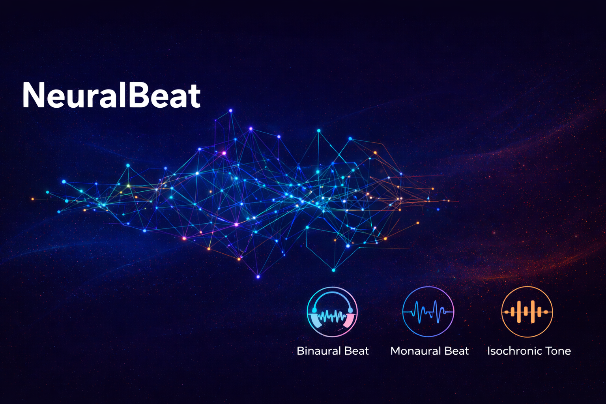

# Binaural Beat Generator

  
   

---

A simple **binaural and monaural beat generator** with a **standalone executable** for Windows.  
No Python installation is required—just download the `.exe` file and run it.

This tool allows you to generate different waveforms and frequencies for the left and right ears, offering both monaural and binaural beat presets.

---

## Features

- Generate **binaural beats** by setting different frequencies for left and right ears.
- Generate **monaural beats** with the same frequency in both ears.
- Choose from different **waveforms**: Sine, Square, Sawtooth.
- Control **volume** independently for each ear.
- **Presets** for popular binaural beat frequencies:
  - 6 Hz, 16 Hz, 40 Hz binaural beats
  - 432 Hz and 528 Hz carrier frequencies
- **Looped playback** until stopped.
- **Simple GUI** using Tkinter with labeled frames and input fields.
- **About dialog** with social media links.
- Works as a **standalone `.exe` file** for Windows.

---

## Download

Download the latest Windows executable from the [Releases](https://github.com/Aegean-Protokolu/OpenSourceBinauralBeatProject/releases) page.

---

## Usage

1. Download and **run the `.exe` file**.
2. Use the GUI to:
   - Set **left and right ear frequencies**.
   - Adjust **volume** for each ear.
   - Select **waveforms**.
   - Use **preset buttons** for common binaural or monaural beats.
   - Click **Generate Beat** to start playback.
   - Click **Stop** to stop the audio.

---

## Presets

### Monaural Beats
- **432 Hz**
- **528 Hz**

### Binaural Beats
- 6 Hz (432 Hz or 528 Hz carrier)
- 16 Hz (432 Hz or 528 Hz carrier)
- 40 Hz (432 Hz or 528 Hz carrier)

---

## License

This project is free for **personal use**. Donations are welcome via Patreon.

- **Twitter**: [@Aegean_E](https://twitter.com/@Aegean_E)  
- **YouTube**: [Aegean_E](https://youtube.com/@Aegean_E)  
- **Patreon**: [Aegean_E](https://www.patreon.com/Aegean_E)  

---

**Ægean - 2023**
